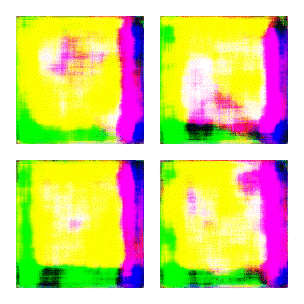
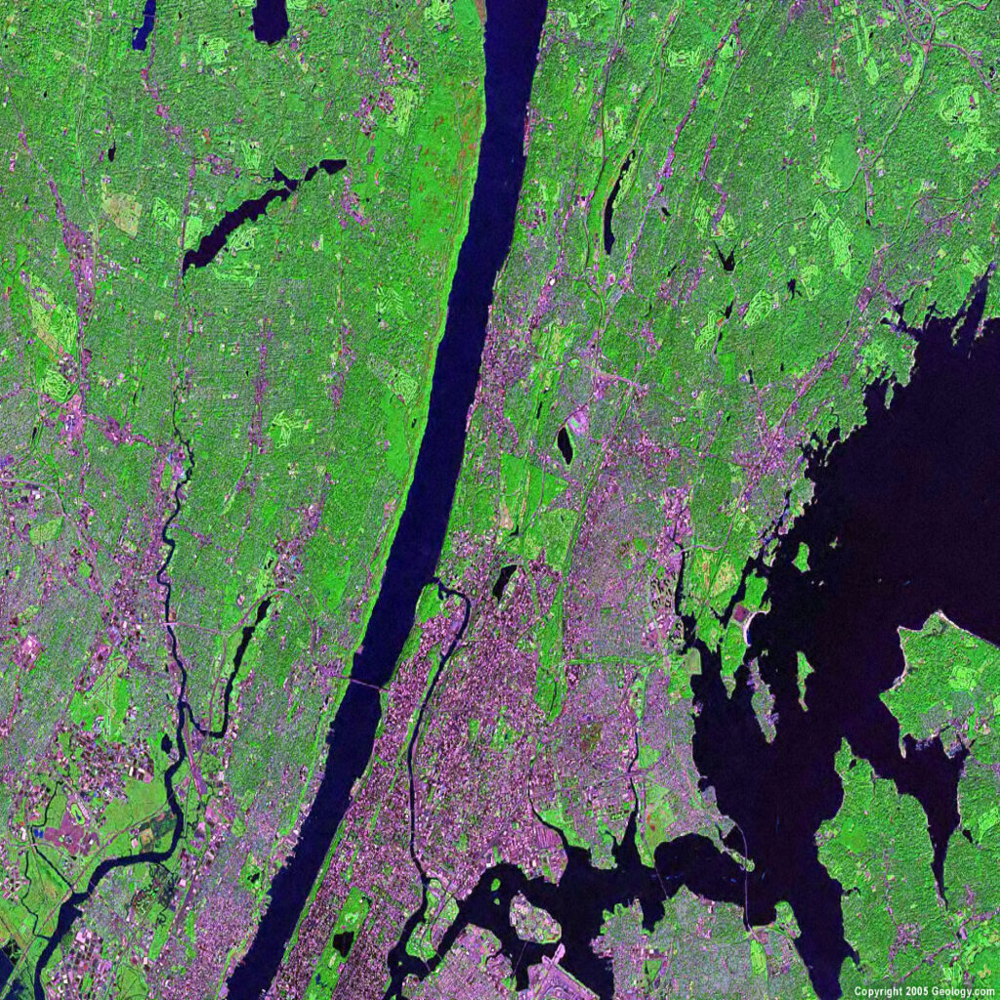

<!-- mapGAN README -->

  <h1>mapGAN</h1>
  

  
gif of evolution of the output over 200 epochs

## About the Project

This project is a collaboration between mjs-py and KaipoCraft to create a generative adversarial neural network that generates novel satellite imagery. This GAN would allow the creation of fantasy maps and a view into the common elements (visible from satellites) of the urban landscape found across the world's megacities.

    
    Sample image from training data

## Roadmap
### Phase 1
- [x] Find a database to train the model off of
- [x] Code the GAN logic in Python using Jupyter Notebook
- [x] Train the GAN
- [x] Get generated output
### Phase 2
- [x] Transfer model to Google Colab to leverage Google Earth Engine
- [x] Import higher resolution NASA Landsat database from Google Earth Engine
- [x] Transform the imagery - reducing cloudiness, pinpount bounding boxes around world's megacities
- [ ] Get the data to transform into tensors for use with tensorflow
- [ ] Train a higher resolution version of the model
- [ ] Get generated output

## License
Distributed under the MIT License. See `LICENSE.txt` for more information.